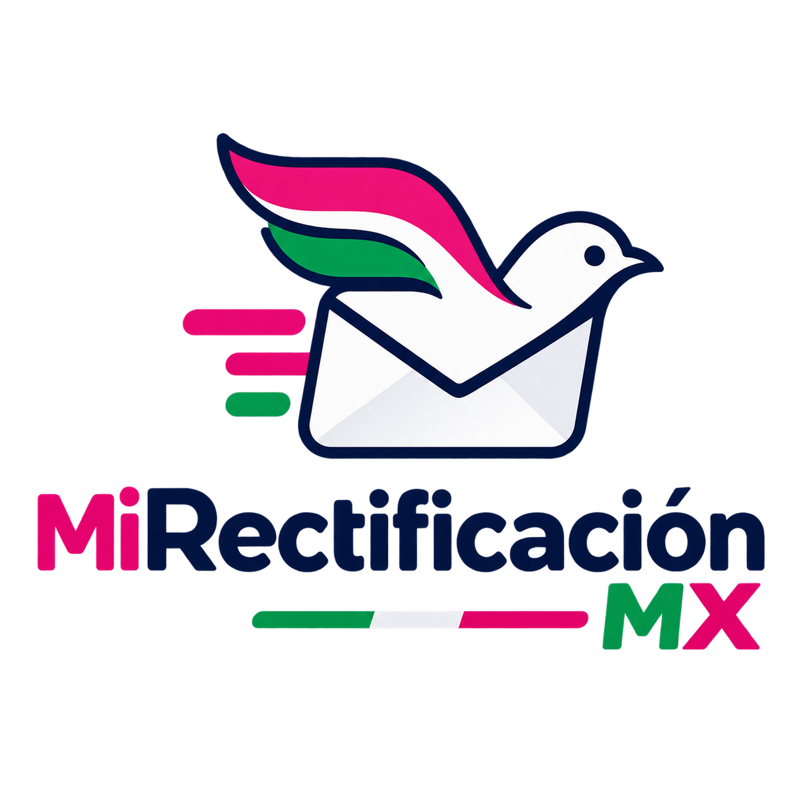
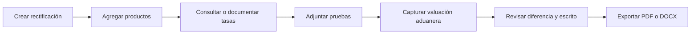

<p align="center">
  
</p>

<h1 align="center">Mi Rectificación MX</h1>

<p align="center">
  Aplicación de escritorio local-first para organizar evidencias, calcular una valoración comprobable y preparar una solicitud de rectificación de una boleta aduanal en México.
</p>

<p align="center">
  
  
  
  
  
</p>

> [!IMPORTANT]
> Mi Rectificación MX no pertenece al SAT, a la ANAM ni a Correos de México. Es una herramienta de apoyo documental; no determina la procedencia de un trámite, no sustituye asesoría legal y nunca envía información automáticamente a una autoridad.

## ¿Qué problema resuelve?

Una rectificación aduanal suele reunir datos dispersos: guía internacional, boleta, productos, monedas, tipos de cambio, facturas, capturas y estados de cuenta. Mi Rectificación MX concentra ese material en un expediente local y ayuda a producir una solicitud coherente, editable y respaldada por evidencias.

La persona usuaria conserva el control final: revisa el escrito, confirma los cálculos y decide qué archivo imprimir o compartir.

## Funciones actuales

| Área | Funcionalidad |
| --- | --- |
| Captura guiada | Asistente de seis pasos: datos generales, envío, productos, comprobantes, pagos y revisión. El avance pendiente se recupera al reiniciar. |
| Expedientes | Barra lateral con búsqueda, novedades, activos y archivados. Permite restaurar, archivar o eliminar definitivamente un expediente con confirmación. |
| Perfil local | Onboarding y configuración con nombre, correo, teléfono y domicilio para autorrellenar nuevos escritos. |
| Productos | Múltiples artículos, cantidad, precio, impuestos, moneda original y equivalencia exacta en MXN. Se pueden agregar o retirar filas. |
| Política de cálculo | El envío se conserva sólo como referencia y no participa en la valoración. Tampoco se aplican descuentos ni se solicita vendedor. |
| Tipo de cambio | Consulta Frankfurter/bancos centrales, conserva fecha efectiva, fuente, URL y hora. Admite una tasa manual con fuente y justificación obligatorias. |
| Valuación aduanera | Guarda automáticamente la valuación presuntiva por expediente y calcula la diferencia en MXN y el porcentaje por encima del valor real comprobado. |
| Evidencias | Admite PDF, JPEG, PNG y WebP de hasta 25 MB para boleta, transacciones, estados de cuenta, facturas y otros anexos. |
| Visor | Una evidencia se abre al hacer clic sobre su fila. Las imágenes y los PDF se descifran únicamente en memoria para mostrarse en el visor. |
| Seguridad local | Evidencias cifradas con AES-256-GCM, clave protegida por el llavero del sistema y huella SHA-256 para verificar integridad. |
| Rastreo | Consulta Correos de México, normaliza movimientos, evita duplicados, admite registros manuales y revisa automáticamente cada 12 horas mientras la app está disponible. |
| Documentos | Exporta un PDF listo para imprimir —solicitud y dossier— o una solicitud editable en DOCX, con selector de ubicación y confirmación de éxito. |
| Preparación de correo | Al exportar, prepara localmente la solicitud PDF, el dossier PDF y un borrador `.eml` con adjuntos. La interfaz de envío permanece reservada para una versión posterior. |
| Ayuda | Preguntas frecuentes sobre recepción en ventanilla, documentación y procedimiento postal. |

## Flujo de trabajo



## Documentos generados

La plantilla documental interna actual es `2026.08-v9`. El expediente puede producir:

- PDF consolidado listo para imprimir;
- solicitud de rectificación en PDF;
- dossier PDF con índice, productos y evidencias;
- solicitud editable en Word (`.docx`);
- borrador de correo (`.eml`) con adjuntos PDF;
- manifiesto de integridad y paquete ZIP para el flujo interno.

El escrito conserva el encabezado dirigido al **C. Administrador de la Aduana, ATO Ciudad de México, Oficina de Intercambio Postal** y utiliza texto Unicode para respetar acentos y la letra `ñ`.

### Tratamiento postal preliminar

La app documenta una evaluación orientativa con base en el valor real acreditado:

- hasta 50 USD: solicita respetuosamente que la autoridad verifique si resulta aplicable el supuesto previsto para la vía postal y, en su caso, ajuste las contribuciones;
- más de 50 USD y hasta 1,000 USD: muestra el cálculo preliminar del 19 % sobre el valor real;
- más de 1,000 USD: no presenta el 19 % como importe definitivo y pide que se determine el procedimiento correspondiente.

La equivalencia USD/MXN y las referencias normativas deben revisarse antes de presentar el escrito.

## Privacidad y seguridad

- SQLite, perfil, expedientes y evidencias permanecen en el equipo.
- Los adjuntos sensibles se cifran antes de guardarse.
- Las vistas previas se descifran sólo en memoria.
- La app no sincroniza expedientes con una nube propia.
- Sólo las consultas solicitadas de rastreo y tipo de cambio contactan servicios externos.
- Los archivos exportados quedan **sin cifrar** en la ubicación elegida para que puedan imprimirse o compartirse.
- Nunca agregues guías reales, identificaciones, facturas o estados de cuenta a este repositorio.

## Tecnología y arquitectura

El proyecto usa Rust y Dioxus 0.7 con una arquitectura por crates:

```text
apps/desktop/          Interfaz Dioxus y adaptadores del sistema operativo
crates/application/    Casos de uso de la aplicación
crates/domain/         Entidades, validaciones y cálculos exactos
crates/storage/        SQLite, migraciones y bóveda cifrada
crates/documents/      PDF, DOCX, EML, manifiesto y ZIP
crates/integrations/   Correos de México y tipos de cambio
crates/security/       AES-256-GCM y manejo de la clave local
assets/                Logo, iconos, estilos y tipografías
tests/fixtures/        Archivos sintéticos para pruebas
```

Los importes usan `rust_decimal`; no se realizan cálculos monetarios con punto flotante.

## Requisitos

- Rust `1.85` o posterior;
- Git;
- dependencias nativas de WebView para Dioxus Desktop;
- conexión a internet únicamente para consultar rastreo o tipos de cambio.

En macOS se requieren las Command Line Tools de Xcode. En Windows se utiliza WebView2. En distribuciones Linux basadas en Debian/Ubuntu puedes instalar las dependencias usadas por CI:

```bash
sudo apt-get update
sudo apt-get install -y libwebkit2gtk-4.1-dev libayatana-appindicator3-dev librsvg2-dev libdbus-1-dev pkg-config
```

## Ejecutar en desarrollo

```bash
git clone https://github.com/richtunic/mi-rectificacion-mx.git
cd mi-rectificacion-mx
cargo run -p desktop
```

Para comprobar una conversión real con el proveedor configurado:

```bash
cargo run -p mi-rectificacion-integrations --example fetch_rate -- JPY 2026-08-14
```

Para generar un expediente sintético de revisión:

```bash
cargo run -p mi-rectificacion-documents --example generate_sample -- output/pdf
```

## Calidad

El workspace mantiene actualmente **45 pruebas automatizadas**. La integración continua ejecuta:

```bash
cargo fmt --all -- --check
cargo clippy --workspace --all-targets -- -D warnings
cargo test --workspace
```

## Estado del proyecto

`0.1.0-beta.2` es una versión beta funcional. Antes de considerarla estable faltan, entre otras tareas:

- validación de empaquetado y firma en macOS, Windows y Linux;
- pruebas con más formatos reales anonimizados de boleta;
- revisión jurídica independiente de referencias y plantillas;
- manejo visual del flujo de correo, actualmente oculto;
- pruebas sostenidas ante cambios del portal de Correos de México.

Consulta [PLAN.md](PLAN.md) para conocer el alcance y las decisiones de diseño.

## Colaborar

Los reportes de errores y propuestas son bienvenidos mediante Issues. No adjuntes información personal ni documentación aduanal real: usa datos completamente anonimizados o sintéticos.

## Licencia

El código declara licencia dual **MIT OR Apache-2.0**. La aplicación se ofrece gratuitamente; conserva los avisos correspondientes al redistribuirla.

## Apoyar el desarrollo

Mi Rectificación MX es gratuita. Si el proyecto te resulta útil, puedes apoyar voluntariamente al desarrollador mediante los enlaces publicados en la aplicación.
